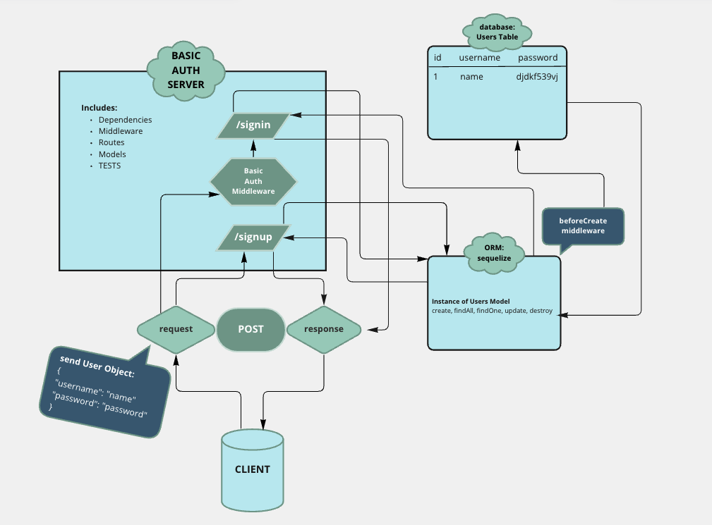

# basic-auth

## Problem Domain:

### As a user, I want to create a new account so that I may later login

Using an HTTP REST client or a web form:
    - Make a POST request to the/signup route with username and password
    - Your server should support both JSON and FORM data as input
    - On a successful account creation, return a 201 status with the user object in the body
    - On any error, trigger your error handler with an appropriate error

### As a user, I want to login to my account so that I may access protected information

Using an HTTP REST client, or a web form:
    - Make a POST request to the /signin route
    - Send a basic authentication header with a properly encoded username and password combination
    - On a successful account login, return a 200 status with the user object in the body
    - On any error, trigger your error handler with the message “Invalid Login”

